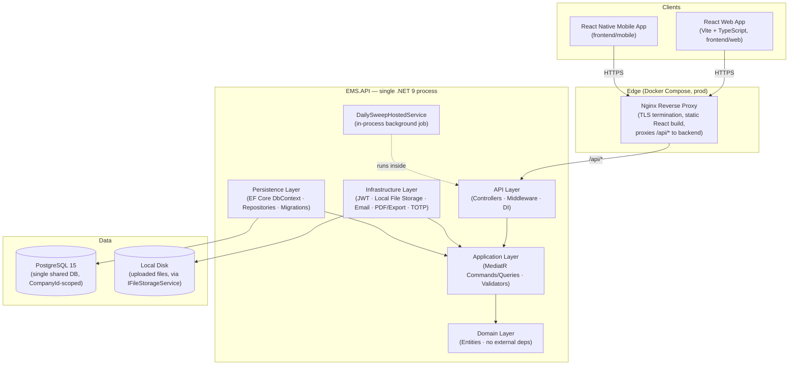
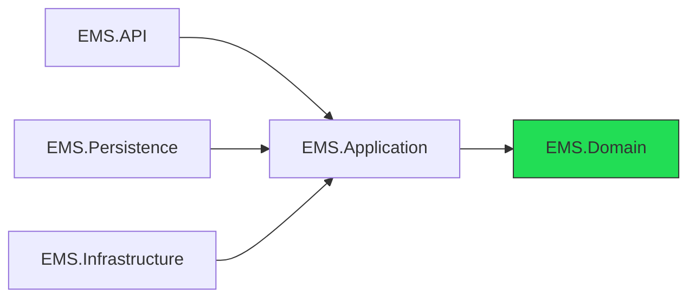
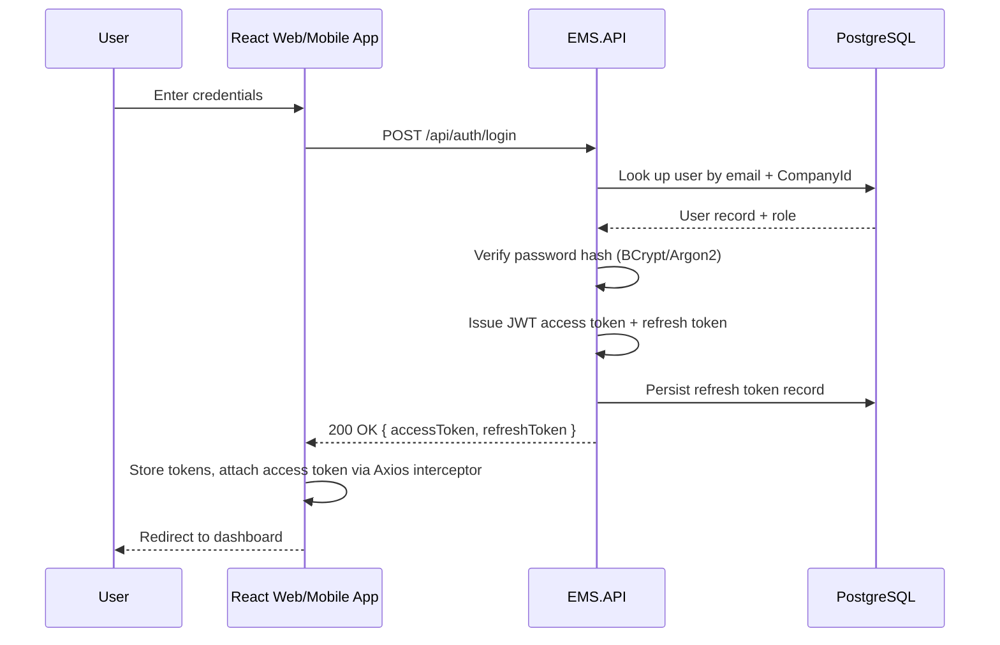
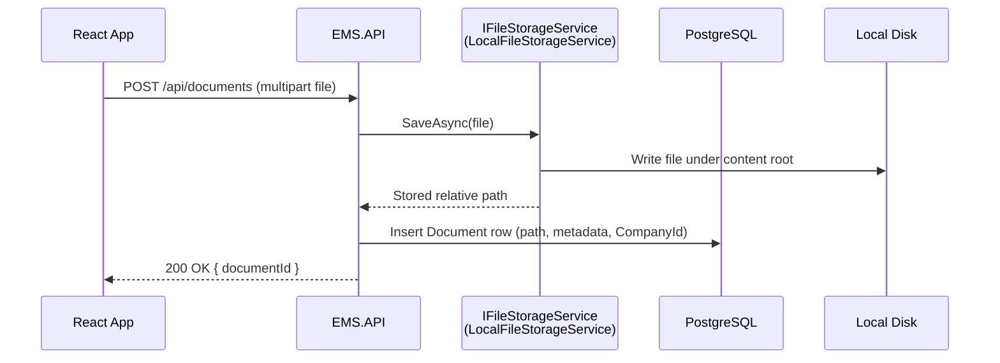
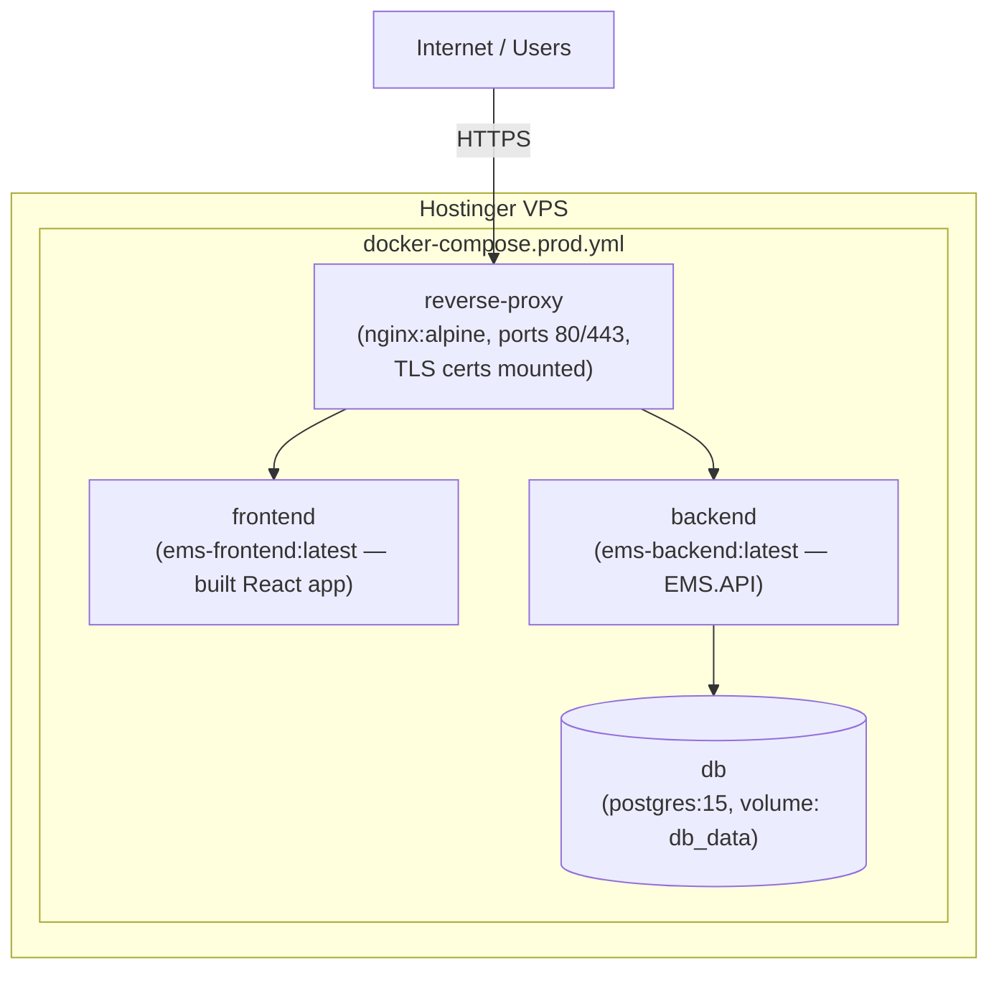

# Employee Management System — Architecture Diagrams (Current State)

> This document describes the system **as it is actually built today**, verified
> against the codebase (`backend/`, `frontend/`, `docker-compose*.yml`,
> `*.csproj`) — not a future proposal. For the narrative/textual description of
> the same system see [`docs/architecture.md`](architecture.md); this file adds
> Mermaid diagrams on top of it. If the two ever disagree, treat that as a bug
> to fix per the Documentation Rules in `CLAUDE.md`.

## 1. Actual Stack

- **Web frontend:** React 18+ (Vite, TypeScript, React Router) — `frontend/web`
- **Mobile frontend:** React Native — `frontend/mobile`, sharing code with web via `frontend/shared`
- **Backend:** a **single** .NET 9 Web API (`EMS.API`) following Clean Architecture internally (API → Application → Domain, with Persistence and Infrastructure also depending inward on Application/Domain) — **not** a set of independently deployed microservices
- **Database:** PostgreSQL 15 — one shared, multi-tenant database (tenant isolation via a `CompanyId` column on tenant-scoped tables), **not** SQL Server
- **Auth:** JWT access tokens + rotating refresh tokens, issued/validated by the same API (there is no separate Identity service/process)
- **File storage:** local disk, behind an `IFileStorageService` abstraction (`LocalFileStorageService`) — used for documents, candidate/task/reimbursement attachments, payslips, and offer letters. **Not** Azure Blob Storage — an `Azure.Storage.Blobs` package reference exists in `EMS.Infrastructure.csproj` but nothing in the codebase constructs a `BlobServiceClient` or uses it; it is currently dead/unwired.
- **Background work:** a single in-process `IHostedService` (`DailySweepHostedService`) running inside the API process — **not** a separate worker service, and **not** Hangfire
- **Messaging (internal):** an in-app "Messaging" feature (conversations/unread counts) backed by PostgreSQL tables, read over normal REST endpoints — **not** RabbitMQ or any message broker
- **Caching / sessions:** none — the API is stateless per request; auth state lives in the JWT itself, not in Redis or any server-side session store
- **Reverse proxy:** Nginx (`docker-compose.prod.yml`) terminates TLS and serves the built React app, proxying `/api` to the backend
- **Deployment:** Docker Compose, on a Hostinger VPS
- **Logging:** Serilog (console sink)

**Explicitly not present** (removed from an earlier draft of this document that
incorrectly proposed them): Angular, an API Gateway, separate Identity/Employee/
Attendance/Notification microservices, SQL Server, Redis, RabbitMQ, and Azure
Blob Storage.

---

## 2. High-Level Architecture

**Key points shown above:**

- There is **one** backend deployable (`EMS.API`), not four. "Identity",
  "Employees", "Attendance", "Messaging", etc. are **feature folders inside
  `EMS.Application/Features/*`**, all compiled into the same process and
  sharing the same PostgreSQL connection.
- Nginx only exists in the production compose file
  (`docker-compose.prod.yml`); the dev compose file (`docker-compose.yml`)
  exposes the frontend and backend on separate ports directly.
- The background job (`DailySweepHostedService`) runs inside the API process
  on a timer — it is not a separately deployed worker and does not use a
  queue.

---

## 3. Clean Architecture Dependency Direction

`EMS.Domain` has no project references at all. `EMS.Application` depends only
on `EMS.Domain`. `EMS.API`, `EMS.Persistence`, and `EMS.Infrastructure` each
depend inward on `EMS.Application`/`EMS.Domain` and never on each other — this
matches the dependency rule in `CLAUDE.md` and `backend/CLAUDE.md`.

---

## 4. Authentication Flow (Login)

No Redis, no gateway, no separate identity process — login is one HTTP call
handled entirely inside `EMS.API`, backed by the same PostgreSQL database as
everything else.

---

## 5. File Upload Flow (e.g., Document / Attachment)

The same pattern is reused for candidate attachments, task attachments,
reimbursement attachments, generated payslips (PDFsharp), and Excel
exports/imports (ClosedXML) — all going through `IFileStorageService` to the
local filesystem, not to any cloud blob store.

---

## 6. Deployment View (Hostinger VPS, Docker Compose)

In local development (`docker-compose.yml`), there is no reverse-proxy
service — `frontend` and `backend` are exposed directly on ports `80` and
`5000` as separate origins, and CORS is configured accordingly.

---

## 7. Component Explanations

### 7.1 React Web App (`frontend/web`)
The primary browser client: React 18+, Vite, TypeScript, React Router, React
Hook Form + Zod, an Axios instance with interceptors for attaching the access
token and handling refresh-token renewal. Talks only to `EMS.API` over REST.

### 7.2 React Native Mobile App (`frontend/mobile`)
A React Native client sharing business logic/types with the web app via
`frontend/shared`. Talks to the same `EMS.API` REST endpoints as the web app —
there is no separate mobile-specific backend. See
[`docs/ARCHITECTURE_MOBILE.md`](ARCHITECTURE_MOBILE.md) for details.

### 7.3 Nginx Reverse Proxy (production only)
Terminates TLS, serves the built React static assets, and proxies `/api/*`
requests to the backend container so both are served from a single origin in
production. Not present in the local dev compose setup.

### 7.4 EMS.API (the backend, as a whole)
A single ASP.NET Core Web API process implementing every business capability
— auth, companies/tenants, employees, attendance, leave, payroll,
recruitment, reimbursements, tasks, documents, messaging, exports — as
feature folders under `EMS.Application/Features/*`, invoked via MediatR
commands/queries from thin controllers in `EMS.API`. It is one deployable
unit: scaling it means running more copies of the whole API, not scaling one
feature independently.

- **EMS.Domain** — entities and core business rules, zero external dependencies.
- **EMS.Application** — CQRS commands/queries, handlers, FluentValidation validators, interfaces (e.g., `IFileStorageService`, `IEmployeeRepository`) that Infrastructure/Persistence implement.
- **EMS.Persistence** — EF Core `DbContext`, entity configurations, migrations, repository implementations against PostgreSQL.
- **EMS.Infrastructure** — concrete implementations of Application interfaces: `LocalFileStorageService`, `LocalEmailSender`, `JwtTokenService`, `RefreshTokenService`, `TotpService` (MFA), `PdfSharpDocumentService`, `ClosedXmlExportService`/`CsvExportService`, `NominatimGeocodingService`, and the `DailySweepHostedService` background job.

### 7.5 PostgreSQL
The single system of record for the whole application. Multi-tenancy is
implemented as a shared database with a `CompanyId` column scoping
tenant-owned rows (per the recent "Multi tenant" work), not
database-per-tenant or schema-per-tenant.

### 7.6 Local File Storage
Uploaded and generated files (documents, attachments, payslips, offer
letters, exports) are written to disk under the API's content root via
`LocalFileStorageService`, with only the path/metadata stored in PostgreSQL.
This is a real operational constraint worth knowing: files live on whatever
host/container volume runs the API, so they need to be included in backup and
volume-persistence planning for the VPS deployment — there is currently no
redundancy or CDN layer in front of them.

### 7.7 JWT Authentication + Refresh Tokens
Access tokens are short-lived JWTs; refresh tokens are longer-lived and
persisted/rotated in PostgreSQL. All validation happens inside `EMS.API`
itself (`JwtTokenService`, `RefreshTokenService`) — there is no separate
identity provider or gateway doing this on the API's behalf.

### 7.8 Internal Messaging Feature
An in-app conversations/unread-count feature (`Features/Messaging`) backed by
ordinary PostgreSQL tables and polled/fetched over REST endpoints. It is an
application feature, not an event bus — there is no publish/subscribe
mechanism or message broker involved.

### 7.9 DailySweepHostedService
A `.NET` `IHostedService` running on a timer inside the API process to
perform periodic maintenance sweeps. It shares the API's lifetime and
resources; it is not a separate worker/queue consumer.

### 7.10 Serilog
Structured logging to the console sink, used throughout the API for request
logging and diagnostics, per the Backend Rules in `CLAUDE.md`.

---

## 8. Known Gaps / Things to Revisit if the System Grows

These aren't implemented and aren't being claimed as implemented — noted here
only so future architecture discussions start from an accurate baseline:

- No caching layer (Redis or otherwise) — every request hits PostgreSQL directly.
- No message broker — cross-feature side effects happen synchronously in-process.
- No cloud object storage — file durability is tied to the VPS disk/volume.
- No API gateway or service mesh — meaningful only once there is more than one deployable backend.
- The `Azure.Storage.Blobs` NuGet reference in `EMS.Infrastructure.csproj` is unused dead weight and could be removed unless there's a near-term plan to wire it up.
