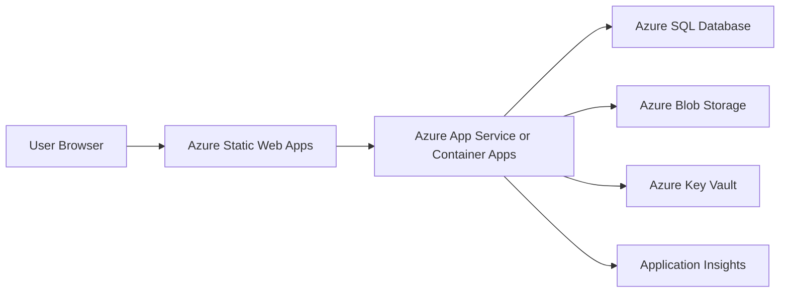

# Employee Management System Architecture

## 1. Overview

The Employee Management System will be built as a modern web application using React 18+ (Vite, TypeScript, React Router), .NET 9 Web API, SQL Server, Docker, and Azure. The backend will follow Clean Architecture so business rules remain independent from frameworks, databases, UI concerns, and cloud infrastructure.

The system must support the MVP modules defined in `docs/requirements.md`:

- Authentication and authorization
- Employee management
- Department, team, designation, location, and reporting hierarchy management
- Attendance management
- Leave management
- Dashboard metrics

The architecture should also leave room for Phase 2 and Phase 3 modules such as payroll, recruitment, assets, performance, expenses, notifications, and integrations.

## 2. Recommended Project Structure

```text
WEB-One/
+-- src/
|   +-- client/
|   |   +-- employee-management-web/
|   |       +-- src/
|   |       |   +-- app/
|   |       |   |   +-- core/
|   |       |   |   |   +-- auth/
|   |       |   |   |   +-- routes/
|   |       |   |   |   +-- api/
|   |       |   |   |   +-- hooks/
|   |       |   |   |   +-- layout/
|   |       |   |   +-- shared/
|   |       |   |   |   +-- components/
|   |       |   |   |   +-- hooks/
|   |       |   |   |   +-- utils/
|   |       |   |   |   +-- models/
|   |       |   |   +-- features/
|   |       |   |   |   +-- dashboard/
|   |       |   |   |   +-- employees/
|   |       |   |   |   +-- departments/
|   |       |   |   |   +-- attendance/
|   |       |   |   |   +-- leave/
|   |       |   |   |   +-- administration/
|   |       |   |   +-- App.tsx
|   |       |   |   +-- main.tsx
|   |       |   +-- .env
|   |       +-- vite.config.ts
|   |       +-- package.json
|   |
|   +-- server/
|       +-- EmployeeManagement.Api/
|       |   +-- Controllers/
|       |   +-- Middleware/
|       |   +-- Filters/
|       |   +-- Extensions/
|       |   +-- Program.cs
|       +-- EmployeeManagement.Application/
|       |   +-- Abstractions/
|       |   +-- Common/
|       |   +-- Features/
|       |   +-- DTOs/
|       |   +-- Validators/
|       |   +-- DependencyInjection.cs
|       +-- EmployeeManagement.Domain/
|       |   +-- Entities/
|       |   +-- Enums/
|       |   +-- ValueObjects/
|       |   +-- Events/
|       |   +-- Common/
|       +-- EmployeeManagement.Infrastructure/
|       |   +-- Persistence/
|       |   +-- Repositories/
|       |   +-- Identity/
|       |   +-- Storage/
|       |   +-- Email/
|       |   +-- Logging/
|       |   +-- DependencyInjection.cs
|       +-- EmployeeManagement.Tests/
|           +-- Unit/
|           +-- Integration/
|           +-- Architecture/
|
+-- docs/
|   +-- requirements.md
|   +-- database-design.md
|   +-- architecture.md
+-- deploy/
|   +-- docker/
|   +-- bicep/
|   +-- pipelines/
+-- README.md
```

## 3. Clean Architecture Layers

### 3.1 Domain Layer

Project: `EmployeeManagement.Domain`

Purpose:

- Own the core business model.
- Contain business entities, enums, value objects, domain events, and shared domain rules.
- Avoid dependencies on Entity Framework Core, ASP.NET Core, React, Azure SDKs, or external infrastructure.

Recommended contents:

- Entities: `Employee`, `Department`, `Team`, `Designation`, `OfficeLocation`, `AttendanceRecord`, `LeaveRequest`, `LeaveBalance`, `Holiday`, `UserAccount`, `RefreshToken`
- Common base types: `BaseEntity`, `AuditableEntity`, `SoftDeletableEntity`
- Enums: `EmployeeStatus`, `AttendanceStatus`, `LeaveStatus`, `LeaveType`, `Role`
- Value objects: `Address`, `ContactInfo`, `EmergencyContact`, `Money`
- Domain events: `EmployeeCreatedEvent`, `LeaveRequestedEvent`, `LeaveApprovedEvent`

Design decision:

The domain layer must stay framework-free so it can be unit tested quickly and reused as the system grows into payroll, recruitment, and performance modules.

### 3.2 Application Layer

Project: `EmployeeManagement.Application`

Purpose:

- Implement use cases and application business rules.
- Define interfaces that infrastructure must implement.
- Validate requests using FluentValidation.
- Return predictable result objects or DTOs to the API layer.

Recommended contents:

- Feature folders by business capability:
  - `Features/Auth`
  - `Features/Employees`
  - `Features/Departments`
  - `Features/Attendance`
  - `Features/Leave`
  - `Features/Dashboard`
- Commands and queries for each use case.
- DTOs and mapping profiles.
- Interfaces such as:
  - `IEmployeeRepository`
  - `IAttendanceRepository`
  - `ILeaveRepository`
  - `IUnitOfWork`
  - `ICurrentUserService`
  - `ITokenService`
  - `IFileStorageService`
  - `IEmailService`
  - `IDateTimeProvider`

Design decision:

The application layer coordinates work but does not know whether data comes from SQL Server, Azure Blob Storage, or another provider. This keeps use cases testable and prevents business logic from leaking into controllers.

### 3.3 Infrastructure Layer

Project: `EmployeeManagement.Infrastructure`

Purpose:

- Implement persistence, authentication services, file storage, email, logging integrations, and other external concerns.
- Use Entity Framework Core for SQL Server access.
- Implement repositories and unit of work.

Recommended contents:

- `ApplicationDbContext`
- EF Core entity configurations
- Repository implementations
- Database migrations
- JWT and refresh token services
- Azure Blob Storage implementation for profile photos and employee documents
- SMTP, SendGrid, or Azure Communication Services email implementation
- Serilog configuration

Design decision:

Infrastructure depends on Application and Domain, while Application only depends on abstractions. This follows dependency inversion and keeps external services replaceable.

### 3.4 API Layer

Project: `EmployeeManagement.Api`

Purpose:

- Expose REST endpoints to the React client.
- Handle request binding, authentication, authorization, exception handling, API versioning, Swagger, and response formatting.
- Delegate business operations to the application layer.

Recommended contents:

- Controllers:
  - `AuthController`
  - `EmployeesController`
  - `DepartmentsController`
  - `AttendanceController`
  - `LeaveController`
  - `DashboardController`
- Middleware:
  - Global exception handling
  - Request correlation
  - Serilog request logging
- Filters:
  - Validation response formatting
  - Authorization policies where needed

Design decision:

Controllers should remain thin. They should validate transport-level concerns, call application use cases, and return HTTP responses without containing business logic.

### 3.5 React Frontend Layer

Project: `employee-management-web`

Purpose:

- Provide a responsive UI using React 18+ functional components and hooks, built with Vite and TypeScript.
- Use React Hook Form with Zod schemas for data entry and validation.
- Use protected route components (React Router) for protected pages.
- Use a shared Axios instance with request/response interceptors for access tokens, refresh token retries, correlation IDs, and error handling.

Recommended structure:

- `core`: auth state (Context/Zustand), the Axios API client and interceptors, protected route components, custom hooks, and layout.
- `shared`: reusable presentational components, custom hooks, utility functions, and models/types.
- `features`: route-level business modules such as employees, attendance, leave, departments, and dashboard.

Design decision:

Feature-based React organization keeps the UI scalable as Phase 2 and Phase 3 modules are added without turning the app into one large shared folder.

## 4. Authentication And Authorization Flow

The system should use JWT access tokens and refresh tokens as required by `AI_CONTRACT.md`.

### 4.1 Login

1. User submits email or username and password from the React login form.
2. React sends credentials to `POST /api/auth/login`.
3. API validates credentials against the identity store.
4. API checks account status, role assignment, and optional MFA requirements.
5. API issues:
   - Short-lived JWT access token.
   - Long-lived refresh token.
6. Refresh token is stored server-side as a hashed value with expiry, revocation state, device metadata, IP address, and audit fields.
7. React stores the access token in memory where possible and uses secure browser storage only when required by UX constraints.

### 4.2 Authenticated Requests

1. The React app's Axios request interceptor attaches the JWT as a bearer token.
2. API validates token signature, issuer, audience, expiry, and claims.
3. API applies role-based and policy-based authorization.
4. Controllers call application use cases with the current user context.

Recommended roles:

- `Admin`: full system administration.
- `HR`: employee, attendance, leave, department, and reporting operations.
- `Manager`: team visibility, attendance review, leave approvals, dashboard summaries.
- `Employee`: own profile, own attendance, own leave requests, own documents.

### 4.3 Refresh Token

1. If an access token expires, the React app's Axios response interceptor calls `POST /api/auth/refresh`.
2. API validates the refresh token against the hashed server-side record.
3. API rotates the refresh token by revoking the old token and issuing a new one.
4. API returns a new access token and refresh token.
5. Reuse of a revoked refresh token should invalidate the token family and force re-login.

### 4.4 Logout

1. React calls `POST /api/auth/logout`.
2. API revokes the active refresh token.
3. React clears local authentication state and redirects to login.

### 4.5 Forgot Password

1. User submits email to `POST /api/auth/forgot-password`.
2. API creates a time-limited password reset token.
3. Email service sends a reset link.
4. User submits a new password to `POST /api/auth/reset-password`.
5. API updates the password and revokes existing refresh tokens.

### 4.6 MFA Support

**Implemented.** TOTP (RFC 6238, the standard "authenticator app" 6-digit code — Google
Authenticator, Authy, etc.), added as a pending authentication state on top of the base login
flow:

1. User credentials are validated (`POST /auth/login`).
2. If `User.IsMfaEnabled`, the API persists a short-lived, single-use `MfaChallenge` row (5 minute
   expiry) and returns `requiresMfa: true` + `mfaChallengeId` instead of tokens. The challenge is
   DB-backed rather than an in-memory cache so it survives process restarts and works correctly
   behind a load balancer.
3. User submits the code to `POST /auth/mfa/verify` along with the `mfaChallengeId`.
4. The API validates the code against the account's TOTP secret — or, as a fallback, against one
   of 10 hashed one-time recovery codes issued at enrollment — and issues the JWT and refresh
   token on success. The endpoint has its own IP-based rate limit
   (`RateLimiting:MfaVerify`, stricter than login's) since a 6-digit code is brute-forceable within
   its validity window without one.

Enrollment (`POST /auth/mfa/setup` → `POST /auth/mfa/enable`), disable, and recovery-code
regeneration are documented in [api-specification.md §3.11–3.14](api-specification.md#311-mfa-setup).
The TOTP secret is encrypted at rest via ASP.NET Core Data Protection (`IMfaSecretProtector`) —
never stored or logged in plaintext after enrollment completes.

## 5. Database Strategy

### 5.1 Database Platform

Use SQL Server for local development and Azure SQL Database in Azure. Use Entity Framework Core migrations to manage schema changes.

Recommended environments:

- Local: SQL Server Developer Edition or SQL Server container.
- Development: Azure SQL Database basic or serverless tier.
- Test/UAT: Azure SQL Database with production-like schema and masked data.
- Production: Azure SQL Database with backups, geo-replication as needed, auditing, and threat detection.

### 5.2 Data Modeling

Core tables:

- `Users`
- `Roles`
- `UserRoles`
- `RefreshTokens`
- `Employees`
- `EmployeeDocuments`
- `Departments`
- `Teams`
- `Designations`
- `OfficeLocations`
- `AttendanceRecords`
- `AttendanceCorrections`
- `LeaveRequests`
- `LeaveBalances`
- `Holidays`
- `AuditLogs`

Phase 2 and Phase 3 tables should be added by bounded feature area, for example Payroll, Recruitment, Assets, Performance, Expenses, and Messaging.

### 5.3 Audit Fields

Every business table should include:

- `CreatedAtUtc`
- `CreatedBy`
- `UpdatedAtUtc`
- `UpdatedBy`
- `DeletedAtUtc`
- `DeletedBy`
- `IsDeleted`
- `RowVersion`

Design decision:

Audit fields and soft delete are required by the AI contract and are important for HR systems because employee-related data often needs traceability.

### 5.4 Soft Delete

Use soft delete for business records such as employees, departments, attendance corrections, leave requests, documents, and locations. EF Core global query filters should exclude deleted records by default.

Hard delete should be restricted to temporary records, expired password reset tokens, and expired refresh tokens where policy allows.

### 5.5 Indexing Strategy

Recommended indexes:

- `Employees(EmployeeCode)` unique.
- `Employees(Email)` unique where active.
- `Employees(DepartmentId, Status)`.
- `Employees(ManagerId)`.
- `AttendanceRecords(EmployeeId, AttendanceDate)` unique.
- `AttendanceRecords(AttendanceDate, Status)`.
- `LeaveRequests(EmployeeId, StartDate, EndDate)`.
- `LeaveRequests(ApproverId, Status)`.
- `RefreshTokens(UserId, IsRevoked, ExpiresAtUtc)`.
- `AuditLogs(EntityName, EntityId, CreatedAtUtc)`.

Design decision:

Indexes are aligned with expected screens: employee search, dashboard summaries, attendance history, leave approvals, and audit lookup.

### 5.6 File Storage

Store binary files in Azure Blob Storage, not SQL Server.

Examples:

- Employee profile photos
- Identity documents
- Offer letters
- NDA files
- Appraisal documents

SQL Server should store file metadata only:

- Blob container
- Blob path
- Original file name
- Content type
- File size
- Uploaded by
- Uploaded date
- Document type

### 5.7 Transactions

Use `IUnitOfWork` for use cases that modify multiple aggregates or tables.

Examples:

- Creating an employee and related user account.
- Approving leave and updating leave balance.
- Correcting attendance and writing audit logs.

## 6. Azure Deployment

### 6.1 Recommended Azure Services

- React frontend: Azure Static Web Apps.
- .NET 9 Web API: Azure App Service for Containers or Azure Container Apps.
- Database: Azure SQL Database.
- File storage: Azure Blob Storage.
- Secrets: Azure Key Vault.
- Monitoring: Azure Application Insights and Azure Monitor.
- Container registry: Azure Container Registry.
- CI/CD: Azure DevOps Pipelines or GitHub Actions.
- Email: Azure Communication Services Email, SendGrid, or approved SMTP provider.

### 6.2 Deployment Topology



### 6.3 Environment Configuration

Use separate Azure resources or resource groups for:

- Development
- Test/UAT
- Production

Configuration should be provided through:

- App Service or Container Apps environment variables.
- Azure Key Vault references for secrets.
- Vite `.env` files for non-secret public configuration such as API base URL.

No secrets, connection strings, signing keys, or passwords should be hardcoded.

### 6.4 CI/CD Pipeline

Recommended pipeline stages:

1. Restore dependencies.
2. Run backend unit tests.
3. Run backend architecture tests.
4. Run frontend linting and tests.
5. Build React app.
6. Build .NET API.
7. Build Docker image for API.
8. Run EF Core migration validation.
9. Push image to Azure Container Registry.
10. Deploy infrastructure with Bicep or Terraform.
11. Deploy API.
12. Deploy React frontend.
13. Run smoke tests.

### 6.5 Observability

Use Serilog structured logging in the API and send logs to Application Insights.

Log these events:

- Authentication success and failure.
- Refresh token rotation and revocation.
- Employee create, update, delete.
- Attendance correction.
- Leave approval and rejection.
- Authorization failures.
- Unhandled exceptions.

Avoid logging:

- Passwords
- JWTs
- Refresh tokens
- MFA codes
- Sensitive document contents

## 7. API Design Guidelines

Use RESTful endpoints grouped by feature.

Examples:

```text
POST   /api/auth/login
POST   /api/auth/refresh
POST   /api/auth/logout
POST   /api/auth/forgot-password
POST   /api/auth/reset-password

GET    /api/employees
POST   /api/employees
GET    /api/employees/{id}
PUT    /api/employees/{id}
DELETE /api/employees/{id}

GET    /api/departments
POST   /api/departments
PUT    /api/departments/{id}
DELETE /api/departments/{id}

POST   /api/attendance/check-in
POST   /api/attendance/check-out
GET    /api/attendance
POST   /api/attendance/corrections

POST   /api/leave/requests
GET    /api/leave/requests
POST   /api/leave/requests/{id}/approve
POST   /api/leave/requests/{id}/reject

GET    /api/dashboard/summary
```

Guidelines:

- Use async/await for all I/O operations.
- Use DTOs instead of exposing EF Core entities.
- Use pagination for list endpoints.
- Use filtering and sorting for employee, attendance, and leave lists.
- Return consistent error responses.
- Version APIs when breaking changes are introduced.

## 8. Cross-Cutting Concerns

### 8.1 Validation

Use FluentValidation in the Application layer for command and query validation.

Examples:

- Employee email must be valid and unique.
- Join date cannot be invalid for business rules.
- Leave end date must be greater than or equal to start date.
- Attendance check-out must be later than check-in.

### 8.2 Exception Handling

Use centralized exception handling middleware in the API.

Map exceptions to HTTP status codes:

- Validation errors: `400 Bad Request`
- Authentication failures: `401 Unauthorized`
- Authorization failures: `403 Forbidden`
- Missing records: `404 Not Found`
- Conflicts: `409 Conflict`
- Unexpected errors: `500 Internal Server Error`

### 8.3 Dependency Injection

Each backend project should expose dependency registration through extension methods:

- `AddApplicationServices()`
- `AddInfrastructureServices()`
- `AddApiServices()`

Design decision:

Keeping registrations near the owning project makes dependencies easier to understand and avoids a large `Program.cs`.

### 8.4 Repository Pattern

Use repositories for aggregate-specific persistence operations and keep EF Core details inside Infrastructure.

Recommended repositories:

- `IEmployeeRepository`
- `IDepartmentRepository`
- `IAttendanceRepository`
- `ILeaveRepository`
- `IUserRepository`
- `IAuditLogRepository`

Avoid creating generic repositories for every entity unless they add clear value. Specific repositories are easier to align with business queries.

### 8.5 Testing Strategy

Recommended tests:

- Domain unit tests for business rules.
- Application unit tests for use cases and validators.
- Infrastructure integration tests for EF Core mappings and repository behavior.
- API integration tests for authentication, authorization, and key endpoints.
- React tests (Vitest + React Testing Library) for protected routes, hooks, forms, and critical components.
- Architecture tests to enforce Clean Architecture dependency rules.

### 8.6 Notification And Announcement Delivery

Personal `Notifications` and company-wide `Announcements` (see [api-specification.md §19](api-specification.md#19-notification-and-announcement-apis-phase-2) and [database-design.md §9](database-design.md#9-notifications-and-announcement-tables)) are delivered poll-based: the frontend calls `GET /notifications/user/{userId}` and `GET /announcements` on page load and on a client-side interval. There is no SignalR, WebSocket, or other push infrastructure in this system today. If real-time delivery becomes a requirement, introduce it as a deliberate addition here rather than assuming it already exists.

## 9. Security Strategy

Security requirements:

- JWT authentication.
- Refresh token rotation.
- MFA (TOTP) — implemented, see [§4.6](#46-mfa-support).
- Role-based authorization.
- Policy-based authorization for ownership and manager approval scenarios.
- Audit logs for sensitive business operations.
- HTTPS everywhere.
- Secure password hashing.
- Secrets stored in Azure Key Vault.
- CORS restricted to approved frontend origins.
- Rate limiting for login, refresh, and forgot password endpoints. **Implemented:** per-client-IP
  fixed-window rate limiting on `POST /auth/login` and `POST /auth/register` (independent budgets,
  each configurable via `RateLimiting:Login` / `RateLimiting:Register`, defaulting to 5 requests per
  60 seconds — see [api-specification.md §3.1](api-specification.md#31-login) and
  [§3.10](api-specification.md#310-register)). `refresh` and `forgot-password` are not yet covered
  and remain future work.

Recommended authorization policies:

- `CanManageEmployees`
- `CanViewEmployeeDetails`
- `CanManageDepartments`
- `CanRecordAttendance`
- `CanCorrectAttendance`
- `CanApplyLeave`
- `CanApproveLeave`
- `CanViewDashboard`

Design decision:

Policies are better than role checks scattered throughout controllers because they keep authorization rules centralized and easier to evolve.

## 10. Scalability And Performance

The system must support 10,000+ employees and target API response times under 2 seconds.

Recommendations:

- Use pagination for all large lists.
- Add database indexes for dashboard, attendance, leave, and employee search queries.
- Use projection queries instead of loading full aggregates for list screens.
- Use async database and storage calls.
- Cache stable lookup data such as departments, designations, leave types, and office locations.
- Move heavy reports and exports to background jobs when needed.
- Store documents in Blob Storage to keep the database lean.

## 11. Design Decisions Summary

- Use Clean Architecture to protect business rules from framework and infrastructure changes.
- Use React functional components, hooks, and feature folders for scalable frontend organization.
- Use JWT access tokens with refresh token rotation for secure session management.
- Use Azure SQL Database with EF Core migrations for relational HR data.
- Use Azure Blob Storage for documents and photos.
- Use audit fields, row versioning, and soft delete for traceability.
- Use Azure Key Vault for secrets and Application Insights for monitoring.
- Use policy-based authorization for maintainable access control.
- Use Docker for consistent API builds and Azure deployment.
